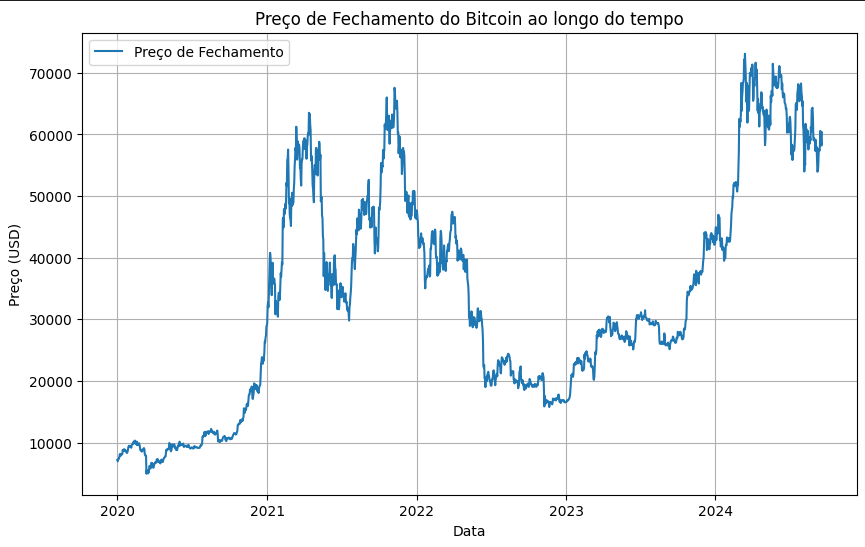
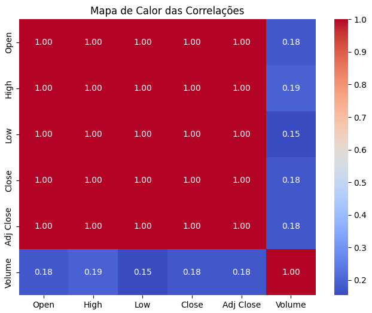
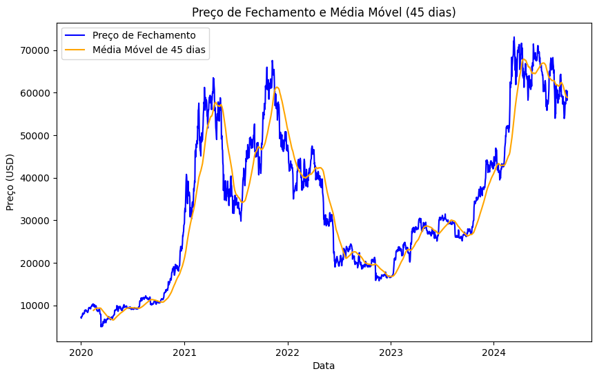

# Ponderada9pts

## Descrição

Ponderada9pts é uma aplicação web para prever ações de criptoativos. O projeto utiliza uma combinação de Flask como backend e React para o frontend, implementando um modelo de previsão com LSTM (Long Short-Term Memory). O objetivo é auxiliar os usuários na tomada de decisões de compra e venda de criptoativos com base em análises preditivas.

## Tecnologias Utilizadas

- **Backend**: Flask
- **Frontend**: React
- **Banco de Dados**: SQLite
- **Machine Learning**: LSTM
- **Documentação da API**: Swagger
- **Containerização**: Docker

## Funcionalidades

- **Explorar Dados**: Coleta dados históricos de criptoativos.
- **Treinar Modelo**: Treina um modelo preditivo com base nos dados coletados.
- **Testar Modelo**: Realiza testes no modelo treinado para avaliar sua eficácia.
- **Prever Valores**: Gera previsões para os próximos 7 dias para o ativo selecionado.
- **Retreinar Modelo**: Atualiza o modelo com dados mais recentes.
- **Avaliar Compra**: Fornece uma recomendação se é o momento certo para comprar ou vender o ativo selecionado.
- **Logs de Interação**: Armazena logs das interações do usuário com a API.

## Estrutura do Projeto

```
└── 📁Ponderada_Giga_M7
    └── 📁api
        └── 📁data
            └── 📁raw
        └── 📁instance
        └── 📁models
        └── 📁static
    └── 📁data
    └── 📁frontend
        └── 📁public
        └── 📁src
            └── 📁components
    └── 📁models
    └── 📁notebooks
```

## Instalação

### Pré-requisitos

- Python 3.x
- Node.js
- Docker

### Passos

1. **Clone o repositório:**
   ```bash
   git clone https://github.com/BrenoSantoS2/Ponderada_Giga_M7
   cd Ponderada_Giga_M7

2. **Rode o container no Docker:**
   ```bash
   docker-compose up --build

3. **Acesse a aplicação**
Após rodar o Docker abra o navegador e acesse http://localhost:3000/

## Documentação da APi

 Após rodar o Docker abra o navegador e acesse http://localhost:5000/swagger.

## Documentação dos Notebooks e Exploração de Dados

### Exploração de dados 
Primeiramente após colher os dados dos criptoativos e baixar da biblioteca Yfinance, comcei a plotar alguns gráficos e fazer algumas analises:

1. **Como o Preço de fechamento (Target) varia ao longo do tempo**

   Fui brincando com essa questão de selecionar diferente recortes temporais para analisar o preço e a variação do mesmo nesses periodos e é muito interressante o fato de que é ua moeda bem instável, mas que de maneira geral apresenta uma tenência de crescimento de formos analisar, o que é um fato muito interessante.

   

2. **Matriz de confusão e Mapa de Calor**

   A matriz de correlação foi bem interessante para entender como as features e os dados providos da bibliotéca estão ligados entre si e seu nível de correlação assim como o próprio nome diz, e com isso deu para tirar de conclusão que várias features apresentarem correlação perfeita (1.00) entre si, indicando que essas variáveis carregam basicamente a mesma informação o que pode sugerir redundância no modelo. Portanto seria interessante deixar apenas a feature Close.

   

3. **Média Móvel**

   Calculando e plotando a média móvel, foi muito interessante para entender se existe algum padrão que fica mais evidente fazendoe esse processo de normalização dos dados e é interessante ver que após uma queda tem uma grande subida e depois varia bastante para ter outra queda e o processo se repete, o que é bem interessante.

   

### Treinando o Modelo

Após fazer uma exploração dos dados, vi que posssui um certo padrão de comportamento, onde após uma queda possuia uma grande subida acompanhada de um momento de pequenas variações e depois uma descida e o ciclo se repetia. Então isso demonstra um forte indício para usar modelos que possuem essa dinâmica Temporal.

Com isso é interessante o uso de modelos de **Rede Neural Recorrente** como o **LSTM**, uma vez que lidam bem com séries temporais e sequências. Além do mais outro modelo interessante é o **ARIMA**, que pode ser uam boa opção para capturar padrões lineares e sazonais.

Mas como já tinha um certo conhecimento com **LSTM** devido ao módulo acabei escolhendo e prosseguindo com ele, para entregar a ponderada no tempo previsto, entretanto o modelo não apresentou resultados muito agradáveis

```
MAE: 280612.0700587559
MSE: 79600366859.73637
RMSE: 282135.36974249856
```

PARA MAIS DETALHES DE CADA ETAPA DO PROCESSO ENTRE NOS NOTEBOOKS DO REPOSITÓRIO.

## Construção da Solução: Motivo por trás da utilização de cada uma das feramentas:

**Backend: Flask**

O Flask é uma framework web leve e simples, ideal para quem está começando a trabalhar com APIs. Sua curva de aprendizado é baixa, tornando mais fácil integrar funcionalidades e manipular rotas HTTP.

**Frontend: React**

React foi escolhido por ser uma biblioteca JavaScript muito popular, que facilita o desenvolvimento de interfaces dinâmicas e responsivas. Sua simplicidade na criação de componentes e o suporte a diversos ecossistemas o tornam ideal para iniciantes.

**Banco de Dados: SQLite**

O SQLite é uma solução de banco de dados simples e sem necessidade de configuração de servidor, o que a torna fácil de aprender e utilizar, especialmente para projetos menores e de desenvolvimento local.

**Machine Learning: LSTM**

A escolha pelo modelo LSTM (Long Short-Term Memory) se deve à sua eficácia na previsão de séries temporais, como o preço de criptoativos. Embora seja um conceito mais avançado, ele oferece bons resultados em problemas que envolvem dependências de longo prazo.

**Documentação da API: Swagger**

O Swagger foi utilizado para gerar e visualizar a documentação da API de forma automática, facilitando tanto o desenvolvimento quanto a interação com os endpoints. É uma ferramenta acessível e intuitiva.

**Containerização: Docker**

O Docker facilita o empacotamento da aplicação em containers, garantindo que ela funcione da mesma forma em qualquer ambiente. Além disso, aprender Docker permite uma transição mais suave para cenários de produção e escalabilidade.
